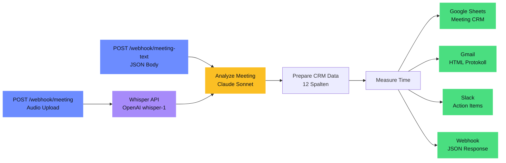

# Meeting Intelligence Pipeline

[](https://n8n.io)
[](#verified-test-results)
[](#architektur)
[](https://github.com/mj-deving/n8n-autopilot)
[](LICENSE)

**Audio-Aufnahme oder Text-Transkript eines Meetings → KI-Analyse → strukturiertes Protokoll mit Action Items, Entscheidungen und Follow-ups.** 14-Node n8n Workflow mit Claude Sonnet via OpenRouter. Verarbeitung in ~19 Sekunden, outputs an Google Sheets, Gmail und Slack.

## Table of Contents

- [Architektur](#architektur) — 14-Node Workflow mit 2 Trigger-Varianten
- [Was es macht](#was-es-macht) — Pipeline-Schritte im Detail
- [Quick Start](#quick-start) — Setup in 5 Schritten
- [Beispiel-Output](#beispiel-output) — echte Slack-Nachricht aus Test
- [Test-Szenarien](#test-szenarien) — 3 verifizierte Szenarien
- [LLM Output Schema](#llm-output-schema) — 8 extrahierte Felder
- [Google Sheets Schema](#google-sheets-schema) — 12 CRM-Spalten
- [Tech Stack](#tech-stack) — Versionen und Abhängigkeiten
- [Credentials](#credentials) — benötigte n8n Credentials
- [Whisper-Optionen](#whisper-optionen) — API vs. lokal (DSGVO)
- [Projekt-Struktur](#projekt-struktur)

## Architektur



| Node | Type | Funktion |
|------|------|----------|
| Text Webhook | webhook | JSON-Input: title, participants, date, transcript |
| Audio Webhook | webhook | Multipart Audio-Upload |
| Whisper Transcription | httpRequest | OpenAI Whisper API (model: whisper-1, language: de) |
| Analyze Meeting | agent (LangChain) | Claude Sonnet analysiert Transkript |
| Claude Model | lmChatOpenAi | OpenRouter → anthropic/claude-sonnet-4 |
| Meeting Schema | outputParserStructured | JSON Schema mit 8 Pflichtfeldern |
| AutoFix Model | lmChatOpenAi | Gemini Flash für Schema-Autofix |
| Prepare CRM Data | code | Formatiert 12 Spalten für Google Sheets |
| Measure Processing Time | code | Verarbeitungsdauer berechnen |
| Log to Google Sheets | googleSheets | Append-Row mit explizitem Column-Mapping |
| Send Protocol Email | gmail | HTML-Protokoll an Teilnehmer |
| Format Slack Message | code | Slack-Markdown mit Priority-Icons |
| Post Slack Actions | slack | Team-Channel, @channel bei urgent |
| Webhook Response | code | JSON-Zusammenfassung als Response |

## Was es macht

1. **Transkript empfangen** — Text-Webhook (JSON) oder Audio-Webhook (multipart → Whisper)
2. **KI-Analyse** — Claude Sonnet extrahiert: Summary, Entscheidungen, Action Items, Offene Fragen, Follow-ups, Key Topics, Sentiment
3. **Google Sheets** — Protokoll als CRM-Zeile mit 12 Spalten
4. **Gmail** — HTML-formatiertes Protokoll an Teilnehmer (Summary, Entscheidungen als Bullets, Action Items als Tabelle)
5. **Slack** — Action Items mit @channel bei high-priority Items

## Quick Start

```bash
# 1. Abhängigkeiten
npm install

# 2. n8n Instance verbinden
npx --yes n8nac init
# URL: http://172.31.224.1:5678

# 3. Google Sheet erstellen
npx --yes n8nac push "workflows/172_31_224_1:5678_marius _j/personal/setup-meeting-sheet.workflow.ts"
npx --yes n8nac workflow activate Cctig8XetXsoKeou
curl http://172.31.224.1:5678/webhook/setup-meeting-sheet

# 4. Hauptworkflow deployen
npx --yes n8nac push "workflows/172_31_224_1:5678_marius _j/personal/meeting-intelligence.workflow.ts"
npx --yes n8nac workflow activate k2VzgzfxKOtosxzn

# 5. Testen
curl -X POST http://172.31.224.1:5678/webhook/meeting-text \
  -H "Content-Type: application/json" \
  -d @workflows/pipelines/meeting-intelligence/test.json
```

## Beispiel-Output

**Slack-Nachricht (Sprint Planning Q2):**
```
@channel *📋 Meeting-Protokoll: Sprint Planning Q2*
_2026-04-14 | Teilnehmer: Marius, Lisa, Thomas_

*Zusammenfassung:* Sprint Planning für Q2 mit Fokus auf Meeting-Intelligence-Pipeline
für Konferenz-Demo am 28. April. Entscheidung für Claude Sonnet über OpenRouter.

*Action Items:*
  🔴 *Thomas*: API-Dokumentation fertigstellen (bis Diese Woche)
  🔴 *Marius*: OpenRouter-Credentials an Thomas teilen (bis Heute)
  🔴 *Thomas*: Whisper-Integration übernehmen (bis Freitag)
  🔴 *Lisa*: Google Sheets Template vorbereiten (bis Mittwoch)
  🟡 *Marius*: Slack-Integration implementieren (bis Donnerstag)
  ⚪ *Thomas*: Lokale Whisper-Option dokumentieren

*Entscheidungen:*
  ✅ Meeting-Intelligence-Pipeline als Sprint-Ziel Nummer eins
  ✅ Claude Sonnet über OpenRouter statt GPT-4
```

## Verified Test Results

| Metrik | Wert |
|--------|------|
| Verarbeitungszeit | 19.4 Sekunden |
| Transkript-Länge | 292 Wörter |
| Action Items extrahiert | 6 |
| Entscheidungen erkannt | 2 |
| Sentiment | positive |
| Alle 12 Nodes | OK |
| Execution ID | #158 |
| Datum | 2026-04-13 |

## Test-Szenarien

3 Test-Payloads in `workflows/pipelines/meeting-intelligence/test.json`:

| # | Szenario | Teilnehmer | Transkript | Erwartung |
|---|----------|------------|------------|-----------|
| 1 | Sprint Planning Q2 | Marius, Lisa, Thomas | 292 Wörter | 3+ Action Items, 2+ Entscheidungen, positive |
| 2 | Kundengespräch Autohaus Müller | Marius, Thomas Müller | 266 Wörter | 2+ Action Items, 1+ Follow-up, positive |
| 3 | Incident Review: API-Ausfall | Marius, DevOps-Team | 281 Wörter | 4+ Action Items, 1+ Entscheidung, negative |

## LLM Output Schema

```json
{
  "summary": "3-5 Sätze Zusammenfassung",
  "decisions": [{"decision": "...", "context": "..."}],
  "action_items": [{"owner": "...", "task": "...", "deadline": "...|null", "priority": "high|medium|low"}],
  "open_questions": ["..."],
  "follow_ups": [{"topic": "...", "when": "...", "participants": ["..."]}],
  "key_topics": ["..."],
  "sentiment": "positive|neutral|negative",
  "duration_estimate_min": 30
}
```

## Google Sheets Schema

| Spalte | Typ | Beschreibung |
|--------|-----|-------------|
| Timestamp | DateTime | Zeitpunkt der Verarbeitung |
| Meeting_Title | Text | Titel des Meetings |
| Date | Date | Meeting-Datum |
| Participants | Text | Teilnehmer (kommagetrennt) |
| Summary | Text | KI-generierte Zusammenfassung |
| Decisions | Text | Entscheidungen (nummeriert) |
| Action_Items | Text | Action Items mit Owner + Deadline |
| Open_Questions | Text | Offene Fragen (nummeriert) |
| Follow_Ups | Text | Geplante Follow-ups |
| Sentiment | Text | positive / neutral / negative |
| Transcript_Length | Number | Wörter im Transkript |
| Processing_Time_Sec | Number | Verarbeitungsdauer in Sekunden |

## Tech Stack

| Komponente | Version / Detail |
|------------|-----------------|
| n8n | 2.x (Windows, WSL-Zugriff via vEthernet Bridge) |
| n8nac | 1.5.0 (code-first workflow development) |
| LLM (Analyse) | anthropic/claude-sonnet-4 via OpenRouter |
| LLM (AutoFix) | google/gemini-2.0-flash-001 via OpenRouter |
| Transkription | OpenAI Whisper API (whisper-1, language: de) |
| Output | Google Sheets + Gmail + Slack |
| Sprache | TypeScript (n8nac .workflow.ts) |

## Credentials

| Credential | Type | Zweck |
|---|---|---|
| OpenRouter | openAiApi | Claude Sonnet + Gemini Flash |
| Google Sheets | googleSheetsOAuth2Api | Meeting-Protokoll CRM |
| Gmail | gmailOAuth2 | Protokoll-Versand |
| Slack Bot | slackApi | Action Items Channel |
| OpenAI (optional) | httpHeaderAuth | Whisper API (nur Audio-Path) |

## Whisper-Optionen

| Option | Einsatz | Details |
|--------|---------|---------|
| **OpenAI API** (Standard) | Demo / schnell | `POST api.openai.com/v1/audio/transcriptions`, model: whisper-1 |
| **Lokaler Server** (DSGVO) | Produktion | `docker run -d -p 9000:9000 onerahmet/openai-whisper-asr-webservice` |

<details>
<summary><strong>Lokaler Whisper-Server Setup</strong></summary>

```bash
# faster-whisper als Docker-Service
docker run -d -p 9000:9000 \
  onerahmet/openai-whisper-asr-webservice:latest

# Im Workflow anpassen:
# Whisper Transcription Node → URL ändern auf:
# http://localhost:9000/asr?language=de&output=json
```

</details>

## Workflows

| Workflow | ID | Status | Nodes |
|---|---|---|---|
| Meeting Intelligence Pipeline | `k2VzgzfxKOtosxzn` | Active | 14 |
| Setup Meeting Intelligence Sheet | `Cctig8XetXsoKeou` | Active | 2 |

## Projekt-Struktur

```
n8n-meeting-intelligence/
├── workflows/
│   ├── pipelines/meeting-intelligence/
│   │   ├── README.md              # Detaillierte Workflow-Dokumentation
│   │   ├── workflow/
│   │   │   ├── workflow.ts        # n8nac TypeScript Source (14 Nodes)
│   │   │   └── workflow.json      # n8n JSON Export
│   │   └── test.json              # 3 Test-Szenarien
│   └── 172_31_224_1.../personal/
│       ├── meeting-intelligence.workflow.ts  # n8nac Sync-Kopie
│       └── setup-meeting-sheet.workflow.ts   # Sheet-Setup Helper
├── scripts/
│   ├── new-workflow.sh            # Scaffold neuer Workflows
│   └── check-secrets.sh           # Pre-commit Secret Detection
├── docs/                          # GitHub Pages + ADRs
├── CLAUDE.md                      # AI Agent Instructions
├── AGENTS.md                      # n8nac Protocol
└── README.md
```

## License

MIT
