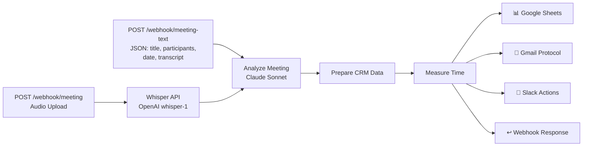

# Meeting Intelligence Pipeline


**Audio-Aufnahme oder Text-Transkript eines Meetings → KI-Analyse → strukturiertes Protokoll mit Action Items, Entscheidungen und Follow-ups.**

## Architektur



## Was es macht

1. **Transkript empfangen** — Text-Webhook (JSON) oder Audio-Webhook (multipart → Whisper)
2. **KI-Analyse** — Claude Sonnet extrahiert: Summary, Entscheidungen, Action Items, Offene Fragen, Follow-ups, Sentiment
3. **Google Sheets** — Protokoll als CRM-Zeile mit 12 Spalten
4. **Gmail** — HTML-formatiertes Protokoll an Teilnehmer
5. **Slack** — Action Items mit @channel bei urgent Priorities

## Quick Start

```bash
# 1. Abhängigkeiten
npm install

# 2. n8n Instance verbinden
npx --yes n8nac init
# URL: http://172.31.224.1:5678

# 3. Google Sheet erstellen
npx --yes n8nac push "workflows/172_31_224_1:5678_marius _j/personal/setup-meeting-sheet.workflow.ts"
npx --yes n8nac workflow activate <sheet-workflow-id>
curl http://172.31.224.1:5678/webhook/setup-meeting-sheet

# 4. Hauptworkflow deployen
npx --yes n8nac push "workflows/172_31_224_1:5678_marius _j/personal/meeting-intelligence.workflow.ts"
npx --yes n8nac workflow activate <workflow-id>

# 5. Testen
curl -X POST http://172.31.224.1:5678/webhook/meeting-text \
  -H "Content-Type: application/json" \
  -d '{"title":"Test Meeting","participants":"Alice, Bob","date":"2026-04-14","transcript":"Alice: Wir brauchen einen Plan..."}'
```

## Beispiel-Output

**Slack-Nachricht (Sprint Planning Q2):**
```
@channel *📋 Meeting-Protokoll: Sprint Planning Q2*
_2026-04-14 | Teilnehmer: Marius, Lisa, Thomas_

*Action Items:*
  🔴 *Thomas*: API-Dokumentation fertigstellen (bis Diese Woche)
  🔴 *Lisa*: Google Sheets Template vorbereiten (bis Mittwoch)
  🟡 *Marius*: Slack-Integration implementieren (bis Donnerstag)

*Entscheidungen:*
  ✅ Meeting-Intelligence-Pipeline als Sprint-Ziel Nummer eins
  ✅ Claude Sonnet über OpenRouter statt GPT-4
```

**Verarbeitungszeit:** 19.4 Sekunden (292 Wörter Transkript)

## Projekt-Struktur

| Verzeichnis | Inhalt |
|---|---|
| `workflows/pipelines/meeting-intelligence/` | Workflow-Source, README, Test-Payloads |
| `workflows/172_31_224_1:5678_marius _j/personal/` | n8nac Sync-Kopien (gepusht zu n8n) |
| `scripts/` | Scaffold + Secret-Detection |
| `docs/` | GitHub Pages + ADRs |

## Credentials

| Credential | Type | Zweck |
|---|---|---|
| OpenRouter | openAiApi | Claude Sonnet + Gemini Flash |
| Google Sheets | googleSheetsOAuth2Api | Meeting-Protokoll CRM |
| Gmail | gmailOAuth2 | Protokoll-Versand |
| Slack Bot | slackApi | Action Items Channel |

## Whisper-Optionen

| Option | Für | Details |
|---|---|---|
| **OpenAI API** (Standard) | Demo/schnell | `whisper-1`, Daten gehen an OpenAI |
| **Lokaler Server** (DSGVO) | Produktion | `docker run -d -p 9000:9000 onerahmet/openai-whisper-asr-webservice` |

Siehe [Workflow-README](workflows/pipelines/meeting-intelligence/README.md) für vollständige Dokumentation.

## Workflows

| Workflow | ID | Status |
|---|---|---|
| Meeting Intelligence Pipeline | `k2VzgzfxKOtosxzn` | Active |
| Setup Meeting Intelligence Sheet | `Cctig8XetXsoKeou` | Active |

## License

MIT
