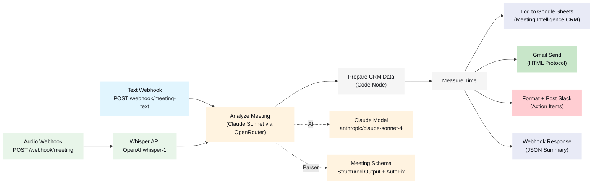

# Meeting Intelligence Pipeline

   

**Meeting audio or text transcript → AI analysis → structured protocol with action items, decisions, and follow-ups.** 14-node n8n workflow powered by Claude Sonnet via OpenRouter. Processing in ~19 seconds, outputs to Google Sheets, Gmail, and Slack.

## Table of Contents

- [Architecture](#architecture) — 14-node workflow with 2 trigger variants
- [How It Works](#how-it-works) — pipeline steps in detail
- [Quick Start](#quick-start) — setup in 5 steps
- [Example Output](#example-output) — real Slack message from test run
- [Test Scenarios](#test-scenarios) — 3 verified scenarios
- [LLM Output Schema](#llm-output-schema) — 8 extracted fields
- [Google Sheets Schema](#google-sheets-schema) — 12 CRM columns
- [Tech Stack](#tech-stack) — versions and dependencies
- [Credentials](#credentials) — required n8n credentials
- [Whisper Options](#whisper-options) — API vs. local (GDPR)
- [Project Structure](#project-structure)

## Architecture



| Node | Type | Purpose |
|------|------|---------|
| Text Webhook | webhook | JSON input: title, participants, date, transcript |
| Audio Webhook | webhook | Multipart audio upload |
| Whisper Transcription | httpRequest | OpenAI Whisper API (model: whisper-1, language: de) |
| Analyze Meeting | agent (LangChain) | Claude Sonnet analyzes transcript |
| Claude Model | lmChatOpenAi | OpenRouter → anthropic/claude-sonnet-4 |
| Meeting Schema | outputParserStructured | JSON schema with 8 required fields |
| AutoFix Model | lmChatOpenAi | Gemini Flash for schema auto-fix |
| Prepare CRM Data | code | Formats 12 columns for Google Sheets |
| Measure Processing Time | code | Calculates processing duration |
| Log to Google Sheets | googleSheets | Append row with explicit column mapping |
| Send Protocol Email | gmail | HTML protocol to participants |
| Format Slack Message | code | Slack markdown with priority icons |
| Post Slack Actions | slack | Team channel, @channel on urgent |
| Webhook Response | code | JSON summary as response |

## How It Works

1. **Receive transcript** — Text webhook (JSON) or audio webhook (multipart → Whisper)
2. **AI analysis** — Claude Sonnet extracts: summary, decisions, action items, open questions, follow-ups, key topics, sentiment
3. **Google Sheets** — Protocol as CRM row with 12 columns
4. **Gmail** — HTML-formatted protocol to participants (summary, decisions as bullets, action items as table)
5. **Slack** — Action items with @channel on high-priority items

## Quick Start

```bash
# 1. Install dependencies
npm install

# 2. Connect n8n instance
npx --yes n8nac init
# URL: http://172.31.224.1:5678

# 3. Create Google Sheet
npx --yes n8nac push "workflows/172_31_224_1:5678_marius _j/personal/setup-meeting-sheet.workflow.ts"
npx --yes n8nac workflow activate Cctig8XetXsoKeou
curl http://172.31.224.1:5678/webhook/setup-meeting-sheet

# 4. Deploy main workflow
npx --yes n8nac push "workflows/172_31_224_1:5678_marius _j/personal/meeting-intelligence.workflow.ts"
npx --yes n8nac workflow activate k2VzgzfxKOtosxzn

# 5. Test
curl -X POST http://172.31.224.1:5678/webhook/meeting-text \
  -H "Content-Type: application/json" \
  -d @workflows/pipelines/meeting-intelligence/test.json
```

## Example Output

**Slack message (Sprint Planning Q2):**
```
@channel *📋 Meeting Protocol: Sprint Planning Q2*
_2026-04-14 | Participants: Marius, Lisa, Thomas_

*Summary:* Sprint planning for Q2 focused on the Meeting Intelligence Pipeline
for the conference demo on April 28. Decision to use Claude Sonnet via OpenRouter.

*Action Items:*
  🔴 *Thomas*: Complete API documentation (by this week)
  🔴 *Marius*: Share OpenRouter credentials with Thomas (by today)
  🔴 *Thomas*: Take over Whisper integration (by Friday)
  🔴 *Lisa*: Prepare Google Sheets template (by Wednesday)
  🟡 *Marius*: Implement Slack integration (by Thursday)
  ⚪ *Thomas*: Document local Whisper option

*Decisions:*
  ✅ Prioritize Meeting Intelligence Pipeline as sprint goal #1
  ✅ Use Claude Sonnet via OpenRouter instead of GPT-4
```

## Verified Test Results

| Metric | Value |
|--------|-------|
| Processing time | 19.4 seconds |
| Transcript length | 292 words |
| Action items extracted | 6 |
| Decisions detected | 2 |
| Sentiment | positive |
| All 12 nodes | OK |
| Execution ID | #158 |
| Date | 2026-04-13 |

## Test Scenarios

3 test payloads in `workflows/pipelines/meeting-intelligence/test.json`:

| # | Scenario | Participants | Transcript | Expected |
|---|----------|-------------|------------|----------|
| 1 | Sprint Planning Q2 | Marius, Lisa, Thomas | 292 words | 3+ action items, 2+ decisions, positive |
| 2 | Customer Call (Autohaus Muller) | Marius, Thomas Muller | 266 words | 2+ action items, 1+ follow-up, positive |
| 3 | Incident Review: API Outage | Marius, DevOps Team | 281 words | 4+ action items, 1+ decision, negative |

## LLM Output Schema

```json
{
  "summary": "3-5 sentence summary",
  "decisions": [{"decision": "...", "context": "..."}],
  "action_items": [{"owner": "...", "task": "...", "deadline": "...|null", "priority": "high|medium|low"}],
  "open_questions": ["..."],
  "follow_ups": [{"topic": "...", "when": "...", "participants": ["..."]}],
  "key_topics": ["..."],
  "sentiment": "positive|neutral|negative",
  "duration_estimate_min": 30
}
```

## Google Sheets Schema

| Column | Type | Description |
|--------|------|-------------|
| Timestamp | DateTime | Processing timestamp |
| Meeting_Title | Text | Meeting title |
| Date | Date | Meeting date |
| Participants | Text | Participants (comma-separated) |
| Summary | Text | AI-generated summary |
| Decisions | Text | Decisions (numbered) |
| Action_Items | Text | Action items with owner + deadline |
| Open_Questions | Text | Open questions (numbered) |
| Follow_Ups | Text | Planned follow-ups |
| Sentiment | Text | positive / neutral / negative |
| Transcript_Length | Number | Words in transcript |
| Processing_Time_Sec | Number | Processing duration in seconds |

## Tech Stack

| Component | Version / Detail |
|-----------|-----------------|
| n8n | 2.x (Windows, WSL access via vEthernet bridge) |
| n8nac | 1.5.0 (code-first workflow development) |
| LLM (Analysis) | anthropic/claude-sonnet-4 via OpenRouter |
| LLM (AutoFix) | google/gemini-2.0-flash-001 via OpenRouter |
| Transcription | OpenAI Whisper API (whisper-1, language: de) |
| Outputs | Google Sheets + Gmail + Slack |
| Language | TypeScript (n8nac .workflow.ts) |

## Credentials

| Credential | Type | Purpose |
|---|---|---|
| OpenRouter | openAiApi | Claude Sonnet + Gemini Flash |
| Google Sheets | googleSheetsOAuth2Api | Meeting protocol CRM |
| Gmail | gmailOAuth2 | Protocol delivery |
| Slack Bot | slackApi | Action items channel |
| OpenAI (optional) | httpHeaderAuth | Whisper API (audio path only) |

## Whisper Options

| Option | Use Case | Details |
|--------|----------|---------|
| **OpenAI API** (default) | Demo / fast | `POST api.openai.com/v1/audio/transcriptions`, model: whisper-1 |
| **Local Server** (GDPR) | Production | `docker run -d -p 9000:9000 onerahmet/openai-whisper-asr-webservice` |

<details>
<summary><strong>Local Whisper Server Setup</strong></summary>

```bash
# faster-whisper as Docker service
docker run -d -p 9000:9000 \
  onerahmet/openai-whisper-asr-webservice:latest

# Adjust in workflow:
# Whisper Transcription Node → change URL to:
# http://localhost:9000/asr?language=de&output=json
```

</details>

## Workflows

| Workflow | ID | Status | Nodes |
|---|---|---|---|
| Meeting Intelligence Pipeline | `k2VzgzfxKOtosxzn` | Active | 14 |
| Setup Meeting Intelligence Sheet | `Cctig8XetXsoKeou` | Active | 2 |

## Project Structure

```
n8n-meeting-intelligence/
├── workflows/
│   ├── pipelines/meeting-intelligence/
│   │   ├── README.md              # Detailed workflow documentation
│   │   ├── workflow/
│   │   │   ├── workflow.ts        # n8nac TypeScript source (14 nodes)
│   │   │   └── workflow.json      # n8n JSON export
│   │   └── test.json              # 3 test scenarios
│   └── 172_31_224_1.../personal/
│       ├── meeting-intelligence.workflow.ts  # n8nac sync copy
│       └── setup-meeting-sheet.workflow.ts   # Sheet setup helper
├── scripts/
│   ├── new-workflow.sh            # Scaffold new workflows
│   └── check-secrets.sh           # Pre-commit secret detection
├── docs/                          # GitHub Pages + ADRs
├── CLAUDE.md                      # AI agent instructions
├── AGENTS.md                      # n8nac protocol
└── README.md
```

## License

MIT
