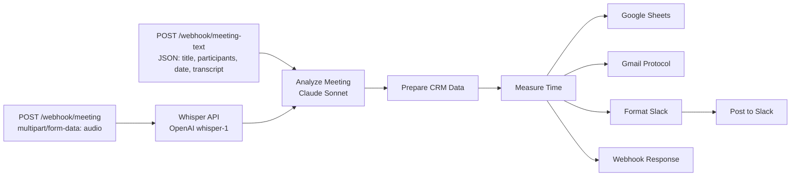

# Meeting Intelligence Pipeline

> Automatische Meeting-Transkription + KI-Analyse = strukturiertes Protokoll mit Action Items

## Overview

Audio-Aufnahme oder Text-Transkript eines Meetings wird per Webhook empfangen, von Claude Sonnet analysiert und als strukturiertes Protokoll in Google Sheets gespeichert, per Email versendet und als Action-Items in Slack gepostet.

**Trigger:** Webhook (POST)
**Nodes:** 14
**LLM:** Claude Sonnet via OpenRouter
**Category:** pipelines

## Architecture



## Nodes

| Node | Type | Purpose |
|---|---|---|
| Text Webhook | webhook | Empfängt Text-Transkript als JSON |
| Audio Webhook | webhook | Empfängt Audio-Datei (multipart) |
| Whisper Transcription | httpRequest | OpenAI Whisper API (model: whisper-1, language: de) |
| Analyze Meeting | agent (LangChain) | Claude Sonnet analysiert Transkript |
| Claude Model | lmChatOpenAi | OpenRouter Credential für Claude Sonnet |
| Meeting Schema | outputParserStructured | JSON Schema für structured output |
| AutoFix Model | lmChatOpenAi | Gemini Flash für Schema-Autofix |
| Prepare CRM Data | code | Formatiert Daten für Google Sheets |
| Measure Processing Time | code | Berechnet Verarbeitungsdauer |
| Log to Google Sheets | googleSheets | Schreibt Protokoll in CRM-Sheet |
| Send Protocol Email | gmail | Sendet HTML-Protokoll an Teilnehmer |
| Format Slack Message | code | Baut Slack-Nachricht mit Action Items |
| Post Slack Actions | slack | Postet in Team-Channel |
| Webhook Response | code | Gibt Zusammenfassung als Response |

## LLM Output Schema

```json
{
  "summary": "3-5 Sätze Zusammenfassung",
  "decisions": [{"decision": "...", "context": "..."}],
  "action_items": [{"owner": "...", "task": "...", "deadline": "...", "priority": "high|medium|low"}],
  "open_questions": ["..."],
  "follow_ups": [{"topic": "...", "when": "...", "participants": ["..."]}],
  "key_topics": ["..."],
  "sentiment": "positive|neutral|negative",
  "duration_estimate_min": 30
}
```

## Test

### Text-Input (empfohlen zum Testen)

**Endpoint:** `POST /webhook/meeting-text`

```bash
curl -X POST http://<N8N_HOST>/webhook/meeting-text \
  -H "Content-Type: application/json" \
  -d '{
    "title": "Sprint Planning Q2",
    "participants": "Marius, Lisa, Thomas",
    "date": "2026-04-14",
    "transcript": "Marius: Willkommen zum Sprint Planning..."
  }'
```

### Audio-Input

**Endpoint:** `POST /webhook/meeting`

```bash
curl -X POST http://<N8N_HOST>/webhook/meeting \
  -F "file=@meeting.mp3" \
  -F "title=Sprint Planning Q2" \
  -F "participants=Marius, Lisa, Thomas" \
  -F "date=2026-04-14"
```

See `test.json` for 3 complete test scenarios (Sprint Planning, Kundengespräch, Incident Review).

## Google Sheets Schema

| Spalte | Beschreibung |
|---|---|
| Timestamp | Zeitpunkt der Verarbeitung |
| Meeting_Title | Titel des Meetings |
| Date | Meeting-Datum |
| Participants | Teilnehmer (kommagetrennt) |
| Summary | KI-generierte Zusammenfassung |
| Decisions | Entscheidungen (formatiert) |
| Action_Items | Action Items mit Owner + Deadline |
| Open_Questions | Offene Fragen |
| Follow_Ups | Geplante Follow-ups |
| Sentiment | positive/neutral/negative |
| Transcript_Length | Wörter im Transkript |
| Processing_Time_Sec | Verarbeitungsdauer in Sekunden |

## Whisper-Integration

### Option A: OpenAI Whisper API (Demo, Standard)

Konfiguriert im Workflow. Benötigt OpenAI API Key als HTTP Header Auth Credential.

```
POST https://api.openai.com/v1/audio/transcriptions
model: whisper-1, language: de
```

### Option B: Lokaler Whisper-Server (DSGVO-konform)

Für den produktiven Einsatz mit personenbezogenen Daten:

```bash
# faster-whisper als Docker-Service
docker run -d -p 9000:9000 \
  onerahmet/openai-whisper-asr-webservice:latest

# Anpassung im Workflow:
# Whisper Transcription Node → URL ändern auf:
# http://localhost:9000/asr?language=de&output=json
```

## Credentials

| Credential | Type | Purpose |
|---|---|---|
| OpenRouter | openAiApi | Claude Sonnet + Gemini Flash (LLM) |
| Google Sheets | googleSheetsOAuth2Api | Meeting-Protokoll CRM |
| Gmail | gmailOAuth2 | Protokoll-Versand |
| Slack Bot | slackApi | Action Items Channel |
| OpenAI (optional) | httpHeaderAuth | Whisper API (nur Audio-Path) |

## Setup

1. `npx --yes n8nac init` — n8n Instance verbinden
2. Sheet erstellen: `npx --yes n8nac push setup-meeting-sheet.workflow.ts` → aktivieren → `GET /webhook/setup-meeting-sheet` triggern
3. Sheet-URL aus der Response in `workflow.ts` → `LogToGoogleSheets.documentId.value` eintragen
4. `npx --yes n8nac push meeting-intelligence.workflow.ts`
5. `npx --yes n8nac workflow activate <id>`
6. Testen mit `curl` (siehe Test-Abschnitt)

## Install

```bash
npx --yes n8nac push meeting-intelligence.workflow.ts

# Oder Import via n8n UI:
# Settings → Import from file → workflow/workflow.json
```

## Beispiel-Output (Sprint Planning Q2)

**Slack-Nachricht:**
```
@channel *📋 Meeting-Protokoll: Sprint Planning Q2*
_2026-04-14 | Teilnehmer: Marius, Lisa, Thomas_

*Zusammenfassung:* Sprint Planning für Q2 mit Fokus auf Meeting-Intelligence-Pipeline
für Konferenz-Demo am 28. April. Entscheidung für Claude Sonnet über OpenRouter.

*Action Items:*
  🔴 *Thomas*: API-Dokumentation fertigstellen (bis Diese Woche)
  🔴 *Marius*: OpenRouter-Credentials an Thomas teilen (bis Heute)
  🔴 *Thomas*: Whisper-Integration übernehmen (bis Freitag)
  🔴 *Lisa*: Google Sheets Template vorbereiten (bis Mittwoch)
  🟡 *Marius*: Slack-Integration implementieren (bis Donnerstag)
  ⚪ *Thomas*: Lokale Whisper-Option dokumentieren

*Entscheidungen:*
  ✅ Meeting-Intelligence-Pipeline als Sprint-Ziel Nummer eins
  ✅ Claude Sonnet über OpenRouter statt GPT-4
```

**Verarbeitungszeit:** 19.4 Sekunden (292 Wörter Transkript)

## Status

- [x] Workflow built (14 nodes)
- [x] Test payloads (3 scenarios)
- [x] Pushed to n8n (ID: k2VzgzfxKOtosxzn)
- [x] End-to-end tested (Execution #158, 19.4s)
- [x] Google Sheet connected (Meeting Intelligence CRM)
